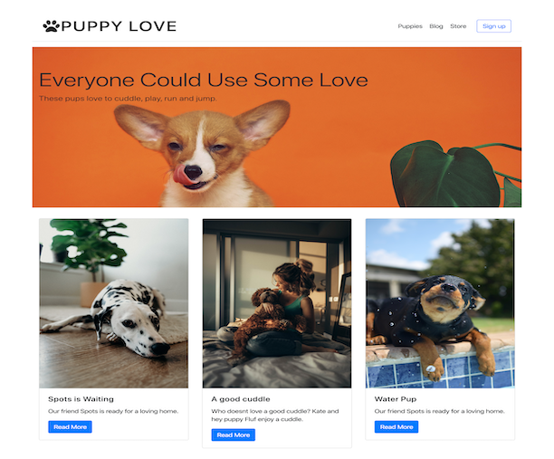

# Puppy Finder App / Puppy Love
This project was bootstrapped with [Create React App](https://github.com/facebook/create-react-app).

## Overview
This is a puppy finder app. It is a simple concept built with React, using components and React Router. This app uses the CRUD operations along with some bootstrap styling. 

There is a blog template, and a table to layout data. I use javascript functionality to manipulate the array of data sent to the components.

Currently live: [Puppy-Love](http://puppylove.adiaguidry.com/#/)
